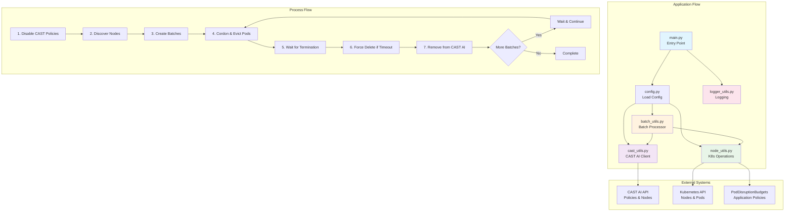

# castaiK8sNodeShuffler

A tool for removing CAST AI nodes from Kubernetes clusters while respecting PodDisruptionBudgets.

## What This Tool Does

The CAST AI Node Manager safely drains and removes CAST AI-managed nodes from your Kubernetes cluster. It:

- **Respects PodDisruptionBudgets**: Uses Kubernetes eviction API to honor application availability requirements
- **Processes in Batches**: Handles multiple nodes in configurable batches for efficiency
- **Parallel Draining**: Drains multiple nodes simultaneously within each batch
- **Force Fallback**: Automatically force-deletes stuck pods after timeout
- **Comprehensive Logging**: Provides detailed logs of all operations

### The Process

1. Disable CAST AI auto-scaling policies
2. Discover CAST AI managed nodes in the cluster
3. Process nodes in batches:
   - Cordon nodes (mark unschedulable)
   - Evict pods using Kubernetes eviction API (respects PDBs)
   - Wait for graceful pod termination
   - Force delete pods if timeout is reached
   - Remove drained nodes from CAST AI
4. Wait between batches to allow cluster stabilization

## How to Deploy

### Prerequisites

- Kubernetes cluster with CAST AI nodes
- CAST AI API key and cluster ID
- kubectl access to the cluster

### Quick Install

1. **Download the deployment manifest:**
```bash
curl -O https://raw.githubusercontent.com/your-org/cast-ai-node-manager/main.yaml
```

2. **Update your credentials:**
```bash
# Encode your API key and cluster ID
echo -n "your-actual-api-key" | base64
echo -n "your-actual-cluster-id" | base64

# Edit main.yaml and replace the base64 values in the Secret section:
# api-key: <your-base64-encoded-api-key>
# cluster-id: <your-base64-encoded-cluster-id>
```

3. **Deploy:**
```bash
kubectl apply -f main.yaml
```

4. **Monitor the CronJob:**
```bash
# Check CronJob status
kubectl get cronjob -n cast-ai-management

# View logs from the latest job
kubectl logs -n cast-ai-management -l app=cast-ai-node-manager --tail=100
```

### Configuration

The CronJob is configured to run **daily at 2 AM UTC**. Key settings in `main.yaml`:

| Setting | Value | Description |
|---------|-------|-------------|
| **Schedule** | `0 2 * * *` | Daily at 2 AM UTC |
| **Batch Size** | `4` | Nodes processed per batch |
| **Drain Timeout** | `3` minutes | Time to wait for graceful eviction |
| **Parallel Drains** | `2` | Max nodes drained simultaneously |
| **Batch Wait** | `60` seconds | Wait between batches |

### Alternative: One-Time Job

To run immediately instead of on schedule:
```bash
kubectl create job --from=cronjob/cast-ai-node-manager cast-ai-drain-now -n cast-ai-management
```

### Configuration

Configure via environment variables:

| Variable | Default | Description |
|----------|---------|-------------|
| `CAST_AI_API_KEY` | Required | Your CAST AI API key |
| `CAST_AI_CLUSTER_ID` | Required | CAST AI cluster identifier |
| `BATCH_SIZE` | 10 | Nodes per batch |
| `DRAIN_TIMEOUT_MINUTES` | 10 | Timeout for graceful eviction |
| `MAX_PARALLEL_DRAINS` | 5 | Max parallel drains per batch |
| `BATCH_WAIT_SECONDS` | 180 | Wait time between batches |
| `LOG_LEVEL` | INFO | Logging level |

## Architecture

The tool is built with a modular design for maintainability and reliability:



### Component Architecture

```
├── main.py              #  Application entry point and orchestration
├── config.py            #  Configuration management and validation
├── logger_utils.py      #  Structured logging with operation tracking
├── cast_utils.py        #  CAST AI API client (policies, nodes, deletion)
├── node_utils.py        #  Kubernetes operations (PDB-aware draining)
├── batch_utils.py       #  Batch processing and parallel execution
└── requirements.txt     #  Python dependencies
```

